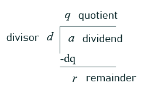

# Division
## Notation for perfect integer division
$$
a|b
$$

a divides b, a is the divisor/factor, b is the dividend

### Example: Determine whether ...
Determine whether 3|7 and 3|12  
3|7, 3 does not divide 7 because remainder $\not=$ 0
3|12, 3 does divide 12, remainder = 0

## Theorem

- a = dq+r
- r = a mod d

### Division with negative numbers
What is the remainder when -11 is divided by 3?
- -11 = 3(-4) + 1, the quotient is -4 and the remainder is 1
	1. -11 / 3 = -3.6666..
	2. Round down to lower negative = -4
	3. -4 * 3 = -12
	4. -11 - (-12) = 1

---
# Modular Arithmetic
r = a **mod** d  
mod is the modulo operation to get the remainder  
dividend - quotient x divisor = remainder

## Congruent Modulo
if `a mod m = b mod m`  
a is congruent to b modulo m:

$$
a \equiv b \mod m
$$

it also implies that

$$
m|(a-b)
$$

### Example: Check whether 2 numbers are congruent using difference method
Check whether a=17 and b=7 is congruent when modulo to 5  
17 - 7 = 10, 10 is divisible by 5 with no remainder therefore, 7 is congruent to 17 mod 5  

$$
17 - 7 = 10 
$$

$$
10 / 5 =2
$$

$$
7 \equiv 17 \space mod \space 5
$$

## Properties of Modular Arithmetic
##### Addition
$$
(a + b) \mod m = ((a \mod m) + (b \mod m)) \mod m
$$
##### Subtraction
$$
(a - b) \mod  m = ((a \mod m) - (b \mod m)) \mod m
$$
##### Multiplication
$$
(a \cdot b) \mod m = ((a \mod m) \cdot (b \mod m)) \mod m
$$
##### Addition Property of Congruences
If a $\equiv$ b mod m & c $\equiv$ d mod m, then

$$
a + c \equiv b + d \mod m
$$

$$
a + d \equiv b + c \mod m
$$

##### Multiplication Property of Congruences
If a $\equiv$ b mod m & c $\equiv$ d mod m, then

$$
ac \equiv bd \mod m
$$

##### Exponential Rule
$$
a^b \mod m \equiv ((a \mod m)^b) \mod m
$$
### Example solving big numbers modulo
400 mod 17  
- (20 x 20) mod 17
- 20 mod 17 = 3
- (3 x 3) mod 17 = 9 mod 17

406 mod 17
- ((400 mod 17) + (6 mod 17)) mod 17
- (9 + 6) mod 17 = 15

9800 mod 97
- (98 x 100) mod 97
- (1 x 3) mod 97 = 3

10001 mod 97
- ((100 x 100) mod 97 + 1 mod 97) mod 97
- ((3x3) + 1) mod 97 = 10

985 mod 97 = ((98 mod 97)^5) mod 97
- (1)^5 mod 97 = 1

900 mod 25
- $=$ 30^2 mod 25
- 5^2 mod 25 = 0
