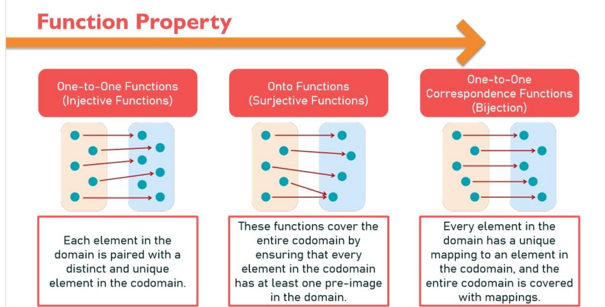
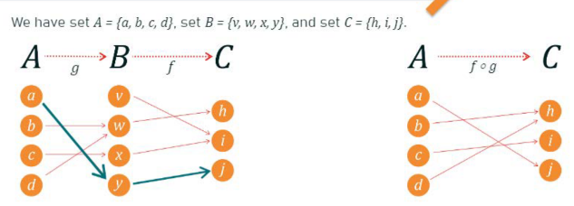
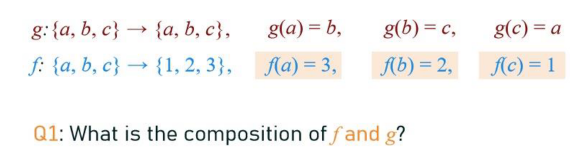

# Functions

$$
f: A\to B
$$

is an assignment of each element of A to exactly 1 element of B.
- a function *f* from *A* to *B*
- Example: we write f(a) = b if b is the unique element of B assigned by the function f to the element of A.

Every element in A has exactly 1 mapping.

If any element in the domain was mapped to more than 1 element in the codomain, or has no mapping, it **would not meet the definition** of a function.

## Domain and Codomain, Image and Preimage
If we say the function *f* is a mapping from *A* to *B*.
- *A* is called the domain of *f*
- *B* is called the codomain of *f*

If *f(a)=b*,
- *a* is called the preimage of *b*
- *b* is called the image of *a* under *f*

## Range and Equal Functions
If we say *f* is a mapping from A to B
- The range of *f* is the **set of all images of points** in *A* under *f*. Denoted by *f(A)*

2 functions are equal when they have the same:
- domain
- codomain
- mapping with each of the element of the domain to the same element of the codomain

## Example:
| Domain          |              | Codomain      |
| --------------- | ------------ | ------------- |
| Set of Students |              | Set of Grades |
|                 |              |               |
| Alice           | $\to$        | A             |
| Bob             | $\to$        | B             |
| Calvin          | $\nearrow B$ | C             |
| Donna           | $\nearrow A$ | D             |
|                 |              | F             |
- Every students has exactly 1 grade
- No student doesn't have a grade
- No student has 2 grades
- It is possible that a grade doesn't have a student ('F' is part of the codomain that doesn't have a corresponding element in the domain)
- Every element in A has exactly 1 mapping (sometimes called transformations)
- $f(Donna)=\text{"A"}$
- $f(Calvin)=\text{"B"}$
- The students are the domain.
- The grades are the codomain
- 'A' is the image of 'Donna'
- 'B' is the image of 'Bob'
- 'C' and 'D' are not images of anything
- 'Bob' and 'Calvin' are preimages of 'B'
- The codomain = {'A','B','C','D','F'}
- The range = {'A','B'}

---

# Properties of Functions

## One-to-One (Injective)
Functions that ensure each element in the domain is paired with a distinct and unique element in the codomain.

A function f is injective if and only if

$$
\begin{gathered}
\forall x\forall y(f(x)=f(y)\implies x=y) \\
\text{Contrapositive: }\forall x\forall y(x \neq y \implies f(x) \neq f(y))
\end{gathered}
$$

means x and y are the same and unique to everything else
- Every element in the codomain has at most 1 mapping

Examples:  
Assignment of ID numbers to people, license plates to cars
- No 2 people have the same ID
- No 2 cars have the same license plate

Example:  
Determine whether the function *f* from {a,b,c,d} to {1,2,3,4,5} with $f(a)=4, ~f(b)=5,~f(c)=1,~f(d)=3$ is one-to-one
- Visualise it
- Since every element in B has at most one arrow coming in, *f* is one-to-one

## Onto (Surjective)
Functions that ensure every element in the codomain has at least 1 pre-image in the domain.
- No element in the codomain is left without a match

A function $f: A\to B$ is called onto if and only if 

$$
\forall b \in B \exists a \in A(f(a)=b)
$$

For every element in the codomain, there is an element in the domain, that maps to it under *f*.

Example:  
Let *f* be the function from {a,b,c,d} to {1,2,3} defined by $f(a)=3.f(b)=2,f(c)=1,f(d)=3$ . Is *f* an onto function?
- Visualise
- Since every element in the codomain has an arrow into it, hence *f* is onto.

Example:
Is the function $f(x) = x+1$ from the set of integers to the set of integers onto?
- Let $y \in \mathbb{Z}$
- We need to show that there is an *a* such that $f(a) = y$
- -> $a=y-1\in \mathbb{Z}$
- Thus, with a=y-1, we have $f(a)=f(y-1)=(y-1)+1=y$
- So, *f* is onto (since we found an 'a' for every 'y' from the set of integers such that f(a)=y, we have demonstrated that every element in the codomain has at least 1 pre-image in the domain)

## One-to-One Correspondence (Bijection)
A function that is both one-to-one and onto.  
It ensures every element in the codomain has exactly 1 mapping from 1 element in the domain
- Every element has at most 1 preimage and has at least 1 preimage
- $|A|=|B|$

Example:
- Determine whether the function *f* from {a,b,c,d,e} to {1,2,3,4,5} with $f(a)=4,f(b)=2,f(c)=1,f(d)=3,f(e)=5$
- Function? Yes, every element in the domain has exactly 1 mapping related
- Bijection? 
	- Yes, we see that there is no element in the codomain that has more than 1 mapping linked to it. -> injective
	- We also see there is no element in the codomain that has no mapping linked. -> surjective
- Conclude function is a bijection

# Function Composition
Composition of 2 functions *f and g* denoted as

$$
f(g(x))\text{ or } f\circ g(x)
$$

- First inner function is g(x)l, outer function is f(x)
- Process: $x\to g(x)\to f(g(x))$

Example: f(x): 3-x, g(x): x2
- $(f \circ g)(3) = 3 - 3^2 = -6$
- $(f \circ g)(5) = 3 - 5^2 = -22$
- $(f \circ g)(x) = f(x^2)=3-x^2$

## Combining functions using composition
Example:  
g: A -> B  
f: B -> C  
We have 2 functions g(x) and f(x), the composition of f of g is f(g(x)), creates a new function from A to C, and we can call it h(x).   
h: A -> C  
Only possible because the codomain of *g* is the exact same domain of *f*

Example:  
  
We want to find the composition of f and g.  
- We can do this for each element in A
- g(a) = y, f(y) = j, f(g(a)) = j
- Do the same for all elements of A and complete the mapping between A and C

Example (set of ordered pairs):  
  
- $(f\circ g)(a) = f(g(a)) = f(b) = 2$
- $(f\circ g)(b)=f(g(b))=f(c)=1$
- $(f \circ g)(c)=f(g(c))=f(a)=3$
- $(f\circ g)(x)=\{ (a,2),(b,1),(c,3) \}$
- We define the function as a set of ordered pairs ^

Continued Example (reverse functions):  
What is the composition of *g and f*?  
- Meaning g(f(x))
- Not possible because the domain of *g* is not the same the subdomain of *f*
	- "The range of *f* is not a subset of the domain of *g*."

Example:   
If *f* and *g* be the functions from the set of integers to the set of integers, defined by $f(x) = 2x+3$ and $g(x)=3x+2$. What is the composition of *f* and *g*?  
- $(f \circ g)(x) = f(g(x))$
- 2(3x+2) + 3 = 6x + 7

# Inverse Functions
Inverse function of *f* is denoted by $f^{-1}$
- Lets you "undo" the action of the original function

A bijective function *f* is called invertible because we can define an inverse of this function.  
A function is not invertible if its not a bijection, because the inverse does not exist.  
- **AN INVERSE FUNCTION IS APPLICABLE TO ONLY BIJECTIVE FUNCTIONS**
- because it has 1-to-1 mapping between both sets

Example:  
Let *f* be the function from the set {a,b,c} to {1,2,3} such that f(a) = 2, f(b) = 3, f(c) = 1. Is f invertible and if it is, what is its inverse?
- Visualise
- Can clearly see its a bijection function (onto and 1-to-1), so it is invertible.
- The inverse function $f^{-1}$ is defined as 
- $f^{-1}(1)=c,f^{-1}(2)=a,f^{-1}(3)=b$

Example:
Let f: $Z\to Z$, such that f(x)= x+1. If *f* is invertible and if it is, what is its inverse?  
One-to-one function
- Assume f(a) = f(b)
- f(a) = a + 1
- f(b) = b + 1
- If a+1=b+1 then a=b. Hence, *f* is injective
Onto Function
- For any integer x, in Z, such that f(x)=y.
- For any integer y, we can find an x, such that x+1=y
- If y=5, then x=4 (since 4+1=5)
- Hence, f is surjective.
Bijective
- Since function f is both injective and surjective, it is a bijection function and it is invertible.
To find the inverse
- Step 1: Replace f(x) with y
	- f(x) = x + 1
	- y = x + 1
- Step 2: Swap x and y
	- y = x + 1
	- x = y + 1
- Step 3: Solve for y
	- x = y + 1
	- y = x - 1
The inverse of the function f(x) is $f^{-1}=x-1$  
Bonus: $f(f^{-1}(x)) = x$  

# Proving Functions
## Proving Injective Functions
Injective Functions: No 2 elements in the domain have the same image
- Each element when passed through the function will result in unique outputs

Direct Approach
- Assume: a,b in the domain, such that f(a)=f(b)
	Goal: Show a=b

Example:  
For the domain of positive real numbers, show that the function f(x) = x2 is injective.  
Show: a=b, where 2 positive real numbers a and b for which f(a) = f(b)

| Step                                        | Reason                         |
| ------------------------------------------- | ------------------------------ |
| f(a)=f(b)                                   | Assumption                     |
| $a^2=b^2$                                   | Definition of f(x), apply f(x) |
| $\sqrt{ a^2 }=\sqrt{ b^2 }$                 | From (2)                       |
| a=b for the domain of positive real numbers |                                |

## Proving Non-Injective Example
Find an example that shows 2 numbers having the same image
- Show by counterexample 

Example:   
For the domain of real numbers, show that the function, f(x) = x2 is not injective.  
Find example:   
- -3 and 3 are numbers of x that will make the function not injective because they give the same value of 9. 

## Proving Surjective Functions
Surjective Functions: Every element in the codomain has at least 1 preimage.

Direct Approach
- Goal: Choose an arbitrary element in codomain and show that there it has a preimage in domain. 
- How: 
	1. Start with an arbitrary element m
	2. Find a corresponding n that maps to m
	3. Show that this n is in the domain
	4. Verify that f(n) = m

Example:  
Show this function is surjective.
- $f: R\to R$ is defined as f(x) = 3x + 2
	- The domains are real numbers

| Step                                                                        | Reason              |
| --------------------------------------------------------------------------- | ------------------- |
| Let $y\in R$ and y is an image of x and is arbitrary                        | Assumption          |
| y = 3x+2                                                                    | Definition of image |
| x = $\frac{y-2}{3}$                                                         | Rearrange           |
| x = $\frac{y-2}{3}$ $\in R$, x is in the domain because it is a real number |                     |
| f(x) = 3(y-2)/3+2                                                           | Sub x into f(x)     |
| Therefore f(x) = y                                                          |                     |
$\therefore$ We found an x mapped to our arbitrary y. Means that for any real number y, we can find an x that maps to it under this function. The function is surjective

## Proving Non-Surjective Example
Find an element in the codomain that does not have a pre-image in the domain
- Find counterexample that shows the function is not surjective

Every element in the codomain has a preimage

Example:
$f:N\to N\text{ defined as }f(n)=2n+2$
where N is the domain of Natural numbers
Try to prove that the function is not surjective
- `5` is a counterexample. 5 is in the codomain where it does not have a preimage.
- $5 = 2n + 2 \to n = 1.5$
- 1.5 is not a natural number
	- $\therefore f$ is not surjective
