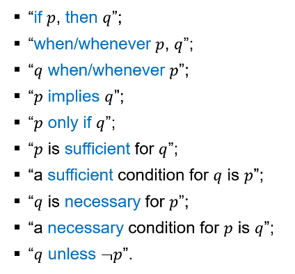
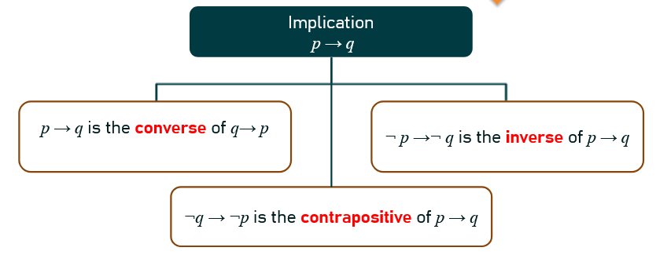
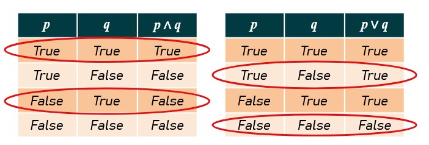
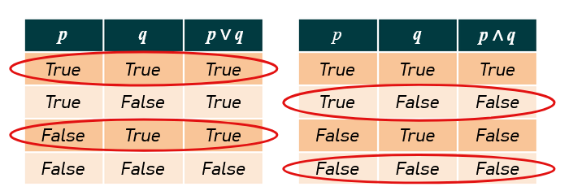
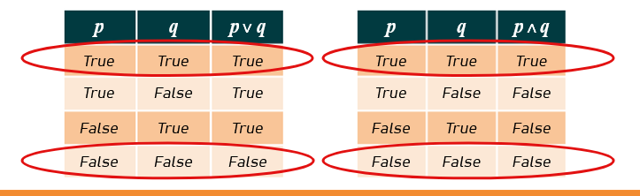
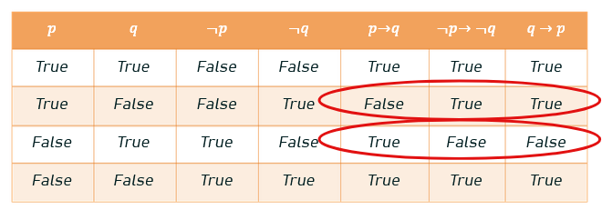
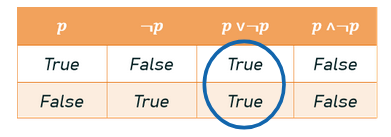
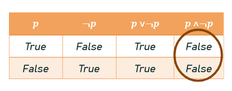
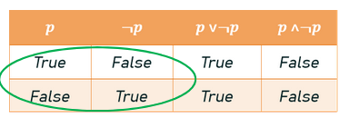

# Propositions
A proposition is a statement that is either true or false.

It can be simple, representing a single statement, or a compound statement
Example:
- Single Statements:
	- The sun is shining
	- It is raining
- Compound Statement:
	- The sun is shining AND it is raining

A proposition can be true or false
- 3 x 4 = 10
	- is a proposition because it is false since the product of 3 x 4 = 12
- Chrome is better than Firefox
	- is a proposition because it is true or false depending on the way we define what "better" means
- "x+y=4"
	- The statement "x + y equals 4" can be a proposition depending on the context and if the variables x and y have fixed values.
	- If "x" and "y" have values, then "x + y equals 4" is either true or false, and is therefore a proposition.
	- However, if "x" and "y" are variables and do not have values, then the statement "x+y equals 4" is not true or false, therefore, it is not a proposition.
- "All digital devices have screens"
	- is a proposition because it is a statement, that can be evaluated as either true or false based on the characteristics of digital devices
- "Please quiet down"
	- is not a proposition because it cant be true or false
- "A classroom"
	- is not a proposition because it is a noun. It doesn't have a value of true or false

# Connectives
is an operation where it connects propositions together  
A connective connecting 2 propositions will make a compound proposition/statement.  
Example:
- "Today is Sunday and I plan to go shopping"
- " $a\le b \space or \space a=0$ "

A single proposition is called an atomic proposition.

## Negation (NOT)
If p is a proposition, the negation of is denoted by $\neg p$. The negation has the opposite value from p.  
Truth Table:

| p     | $\neg p$ |
| ----- | -------- |
| True  | False    |
| False | True     |
Notation:

$$
\neg p,~ \sim p, ~ !p, ~ \overline p
$$

Example:
- It is raining 
	- A proposition
- It is not raining 
	- A proposition using negation
	- If the first proposition is True, this proposition will be false

| p                             | $\neg p$                          |
| ----------------------------- | --------------------------------- |
| Chrome is better than Firefox | Chrome is not better than Firefox |
| X equals 7                    | X does not equal                  |

## Conjunction (AND)
For 2 propositions p and q, the conjunction of p and q is denoted as $p \wedge q$.  
This proposition is True **only when both p and q are True**.

Notation:

$$
p \wedge q, ~ p \bullet q
$$

Example:
- It is raining and I want to stay home
- Let p be "It is raining" & q be "I am home"

| p     | q     | $p\wedge q$ |
| ----- | ----- | ----------- |
| True  | True  | True        |
| True  | False | False       |
| False | True  | False       |
| False | False | False       |

## Disjunction (OR)
For 2 propositions p and q, the disjunction of p and q is denoted as $p\vee q$.  
It is False **only when both p and q are False**.

| p     | q     | $p\vee q$ |
| ----- | ----- | --------- |
| True  | True  | True      |
| True  | False | True      |
| False | True  | True      |
| False | False | False     |

Notation:

$$
p \vee q, ~ p + q, p\setminus \setminus q
$$

Example:
- I'll go home or watch a movie
	- Its only false when I don't plan to watch a movie or go home

## Exclusive Disjunction (XOR)
For 2 propositions p and q, the exclusive disjunction (xor) of p and q is denoted by $p \oplus q$.
It is true only when either p or q are True, **but not both**

| p        | q        | $p\oplus q$ |
| -------- | -------- | ----------- |
| **True** | **True** | **False**   |
| True     | False    | True        |
| False    | True     | True        |
| False    | False    | False       |
Notation:

$$
p \oplus q, ~ p ~ xor ~ q
$$

Example:
- I am a student or "I am eating potato chips"
- $p \oplus q \oplus r$ / $p \oplus r \oplus q$
	- Same statements, & if p is True, q is True, r is False, both statements are False because XOR means only 1 can be True so that the whole statement is True

---
## Implication
For 2 propositions p and q, p implies q is denoted by $p \implies q$.  
It is read as "if p then q", if p is true, then I expect q is true.  
"IF...., then one/something will..."  
If `condition`, then ... will `consequence`

Identification of implication:  
Pay attention to keywords like:  
- "whenever"
- "when"
- "if"
- "only if"
- "unless"
"only" this keyword means that there is a restriction to a specific condition, **this itself is a condition**  

Example:
- I only take notes when I am in class
	- "I only take notes" implies that taking notes is restricted to a specific condition.
	- "when I am in class" specifies that condition.
	- 

Implication also does not mean causality and does not suggest a connection between the propositions.

| p     | q     | $p \implies q$ |
| ----- | ----- | -------------- |
| True  | True  | True           |
| True  | False | False          |
| False | True  | True           |
| False | False | True           |
Example:
- if p = "I am in class" and q = "I take notes"
- $p \implies q$ = "If I am in class, then I will take notes"
- $p\implies q$ is **only FALSE** when I am in class **but I didn't take notes**
- $a \implies b$ 
	- b is True whenever a is True
	- a being True is sufficient for us to conclude that b is True
	- b being True follows from a being True
	- b is necessary for a
- What is $p \implies q$ when p = "it rains" and q = "I stay at home"
	- I stay at home whenever it rains
	- The fact that it is raining is sufficient for us to know that I stay at home
	- Me staying at home follows from the fact that it rains
	- Me staying at home is a necessary condition for rain
- Fact: whenever it rains, there must be a cloud
	- $p \implies q$, p is the rain and q is cloud presence, rain implies clouds

### Types of implications (Converse, Contrapositive, Inverse)

$q\implies p$ is the converse of $p\implies q$ 
- **does not have the same truth table** as $p\implies q$
- If I see Alice, I know Bob is around
	- is not the same as
- If i see Bob, I know Alice is around

$\neg q\implies \neg p$ is the contrapositive of $p\implies q$
- has the **same truth table**
- If I see Alice, I know Bob is also here, $p\implies q$
	- is the same as
- If Bob is not here, then Alice is also not around $\neg q \implies \neg p$

$\neg p\implies \neg q$ is the inverse of $p\implies q$
- does **not have the same truth table** as $p\implies q$
- $p\implies q$ If I see Alice, I know Bob is also here
- $\neg p\implies \neg q$ If I don't see Alice then I know Bob is not here

Implication & Contrapositive have the same meaning  
Converse & Inverse have the same meaning

| p     | q     | $p\implies q$ | $q\implies p$ | $\neg q\implies \neg p$ | $\neg p\implies \neg q$ |
| ----- | ----- | ------------- | ------------- | ----------------------- | ----------------------- |
| True  | True  | True          | True          | True                    | True                    |
| True  | False | False         | True          | False                   | True                    |
| False | True  | True          | False         | True                    | False                   |
| False | False | True          | True          | True                    | True                    |

Example:  
If p = "I am in class"  
and q = "I take notes"  
$p\implies q$ = "If I am in class then I will take notes"  

The converse: $q\implies p$ = "If I take notes, I am in class"  
The contrapositive $\neg q\implies \neg p$ = "If I am not taking notes, I'm not in class"  
The inverse: $\neg p\implies \neg q$ = "If I am not in class, I am not taking notes"

Example:
- "All elephants are smart"
- p -> q = "If there is an elephant then it is smart"
- q -> p = "If something is smart then it is an elephant" (different) OR "Only elephants are smart"
- $\neg q\implies \neg p$ = "If something is not smart, then it is not an elephant" (same as initial implication)
- $\neg p \implies \neg q$ = "If something is not an elephant, then it is not smart"

---
## Biconditional
### 2 Directional Implication
For 2 proposition p and q, the biconditional denoted $p\leftrightarrow q$ is read as "p if and only if q"  
It could mean:  
- p is True only if q is True
- p is False only if q is False
- $p\leftrightarrow q \equiv (q\implies p)\wedge(p\implies q)$

| p     | q     | $p\implies q$ | $q\implies p$ | $(q\implies p)\wedge(p\implies q)$ (aka $p\leftrightarrow q$) |
| ----- | ----- | ------------- | ------------- | :-----------------------------------------------------------: |
| True  | True  | True          | True          |                             True                              |
| True  | False | False         | True          |                             False                             |
| False | True  | True          | False         |                             False                             |
| False | False | True          | True          |                             True                              |

The biconditional is True when 2 atomic proposition have the same value  
The biconditional is False when 2 atomic composition has a different value  
p is a necessary and sufficient condition for q (goes the same when swapped)

Example:
- p = "I breathe"
- q = "I am alive"
- $p\leftrightarrow q$ = "I breathe if and only if I am alive"
- Me breathing is necessary and sufficient condition for me to be alive

---
# Precedence of Logical Operators & De Morgan's Law
## Precedence of Logical Operators

|  Connectives  |     Operator      | Precendence | Group     |
| :-----------: | :---------------: | :---------: | --------- |
|   Negation    |      $\neg$       |      1      | Highest   |
|  Conjunction  |     $\wedge$      |      2      | 2nd Group |
|  Disjunction  |      $\vee$       |      3      | 2nd Group |
|  Implication  |    $\implies$     |      4      | 3rd Group |
| Biconditional | $\leftrightarrow$ |      5      | 3rd Group |
Brackets will still precede over all

Example:
- $p\vee q \implies \neg r$ when p = True, q = False, r = True
	- $p\vee q \implies False$
	- $True \implies False$
	- False

## De Morgan's Law
Fundamental Principles in logic that relate to the negation of logical statements

### Negating a conjunction (1st law)
$$
\neg(p\wedge q)\equiv \neg p\vee \neg q
$$

| p     | q     | $\neg p$ | $\neg q$ | $p\wedge q$ | $\neg$($p\wedge q$) | $\neg p\vee \neg q$ |
| ----- | ----- | -------- | -------- | ----------- | ------------------- | ------------------- |
| True  | True  | False    | False    | True        | False               | False               |
| True  | False | False    | True     | False       | True                | True                |
| False | True  | True     | False    | False       | True                | True                |
| False | False | True     | True     | False       | True                | True                |
Example: 
- p: The weather is hot
- q: The weather is humid
- It is not the case that the weather is hot and humid $\equiv$ The weather is either not hot or not humid

### Negating a disjunction (2nd law)
$$
\neg(p\vee q)\equiv \neg p\wedge \neg q
$$

| p     | q     | $\neg p$ | $\neg q$ | $p\wedge q$ | $\neg$($p\vee q$) | $\neg p\wedge \neg q$ |
| ----- | ----- | -------- | -------- | ----------- | ----------------- | --------------------- |
| True  | True  | False    | False    | True        | False             | False                 |
| True  | False | False    | True     | True        | False             | False                 |
| False | True  | True     | False    | True        | False             | False                 |
| False | False | True     | True     | False       | True              | True                  |
Example:
- p: We have an assignment
- q: We have a test
- $\neg$($p\vee q$) = It is not the case that we have an assignment or a test
- $\neg p\wedge \neg q$ = We don't have an assignment and we don't have a test

# Logical Equivalences
aka logical identities or laws, provide us with alternative expressions that have the same truth value  
T = True, F = False
## Identity Laws
$$
p\wedge T \equiv p
$$

$$
p \vee F \equiv p
$$

## Domination Laws
$$
p\vee T \equiv T
$$

$$
p \wedge F \equiv F
$$

## Idempotent Laws
$$
p\vee p\equiv p
$$

$$
p\wedge p\equiv p
$$

## Negation and Double Negation Laws
$$
p\vee \neg p \equiv T
$$

$$
p\wedge \neg p \equiv F
$$

$$
\neg(\neg p)
$$

## Commutative Laws
$$
p\vee q \equiv q\vee p
$$

$$
p\wedge q \equiv q\wedge p
$$

## Associative Laws
$$
(p\wedge q) \wedge r \equiv (q\wedge r) \wedge p 
$$

$$
(p\vee q) \vee r \equiv (q\vee r) \vee p 
$$

## Distributive Laws
similar to distributive law when doing multiplication to factors

$$
p\vee(q\wedge r) \equiv (p\vee q)\wedge(p\vee r)
$$

$$
p\wedge(q\vee r) \equiv (p\wedge q)\vee(p\wedge r)
$$

## Proving Logical Equivalences
Example:
Prove that the expression $\neg(p\vee(\neg p\wedge q))$ is equivalent to the expression $\neg(p\vee q)$
- $\neg(p\vee(\neg p\wedge q)) \equiv \neg(p\vee q)$ 
- $\neg p \wedge \neg(\neg p\wedge q) \equiv \neg(p\vee q)$
- $\neg p \wedge (p\vee \neg q) \equiv \neg(p\vee q)$
- $(\neg p \wedge p)\vee(\neg p\wedge \neg q) \equiv \neg(p\vee q)$
- F $\vee(\neg p\wedge \neg q) \equiv \neg(p\vee q)$
- Apply Identity Law
- $(\neg p\wedge \neg q) \equiv \neg(p\vee q)$
- $\neg(p\vee q)\equiv \neg(p\vee q)$

# Equivalent Propositions
## Inverse and Converse Statements are the same
Example:
- "if it snows today, (then) I will ski tomorrow"
- converse = If I ski tomorrow, it snows today
- inverse = If it doesn't snow today, I will not ski tomorrow

2 proposition are **equivalent** if and only if they **always have the same truth value.**

## Non-Equivalence
Example:
- Show that neither the converse nor inverse of an implication are equivalent to the implication
	- Represent converse and inverse of an implication in a truth table
	- 
	- Row 2: Implication (False), Inverse(True), Converse(True)
	- Row 3: Implication (True), Inverse(False), Converse(False)

# Tautologies, Contradictions, Contingencies

| Tautologies                                           | Contradictions                                        | Contingencies                                                  |
| ----------------------------------------------------- | ----------------------------------------------------- | -------------------------------------------------------------- |
| Statement that is always True                         | Statement that is always False                        | May be True or False                                           |
| Independent of truth values assigned to its variables | Independent of truth values assigned to its variables | Depends on the specific truth values assigned to its variables |
## Tautology
A proposition which is **always True**

$p\vee \neg p$ is an example of a tautology
- 
- Either you are at home or you are not

$(p \vee q)\implies(q\vee p)$
- It will always be true , X -> X

## Contradiction
A proposition which is **always False**

$p\wedge \neg p$ is an example of a contradiction
- 
- You are at home you are not at home

$(p\vee q)\wedge(\neg p\wedge \neg q)$
- Try to test for True for AND operation
- Both LHS and RHS need to be True
- RHS True: when p is false and q is false
- Check LHS: result will be false
- false $\wedge$ true = false
- So the statement is a contradiction because it will always be false

## Contingency
A proposition which is not a tautology or a contradiction. aka a satisfiable proposition or expression. Can be True or False
- 
- "You will pass this module"

$(p \vee q)\implies(p\wedge q)$ Is this a contingency?
- If p is True & q is False
- LHS: True
- RHS: False
- True implies False = False
- If p is False & q is False
- LHS: False
- RHS: False
- False implies False = True
- So, the statement is a contingency based on the value of p and q.

## Satisfiability
refers to whether a statement can be made True

- Tautology
	- Always satisfiable
- Contradictions
	- Never satisfiable
- Contingencies
	- Can be satisfied or not satisfied
	- But is still satisfiable

To find a satisfiability of a compound propositions,
- have to find a set of truth values to assign the atomic propositions, such that the compound proposition is True

Examples:
$(p\vee \neg q)\wedge(q\vee \neg r)\wedge(r\wedge \neg p)$
- whatever values of p and q and r is,
- The statement is unsatisfiable