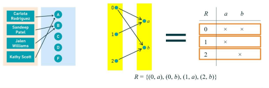
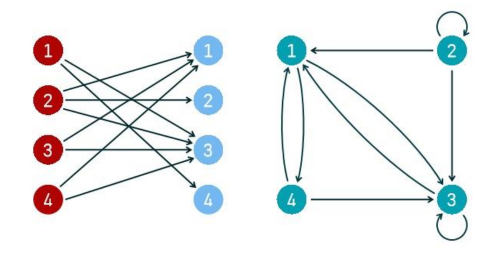
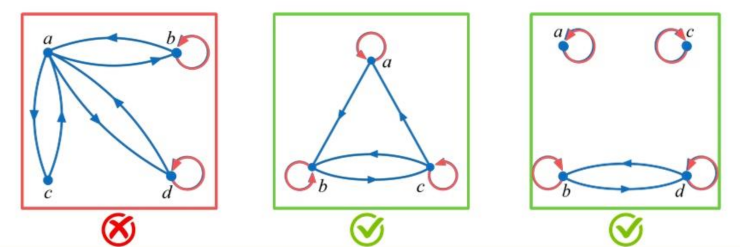
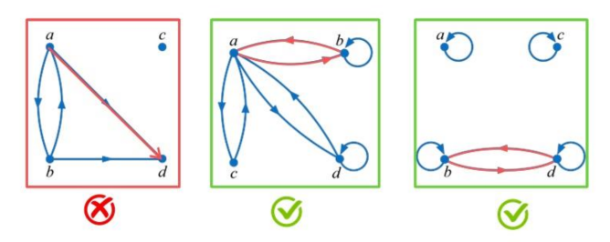
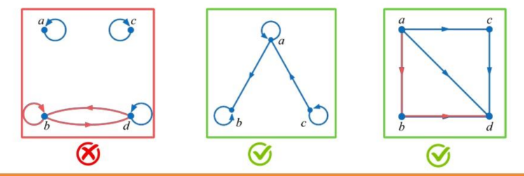
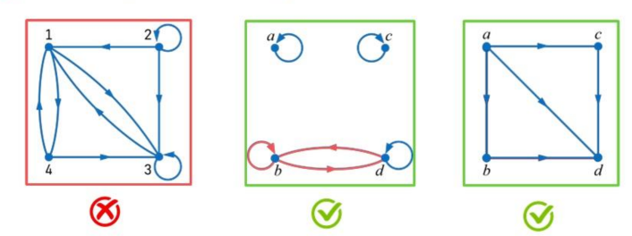
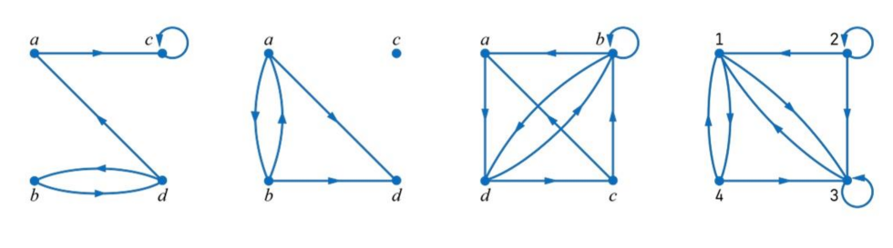
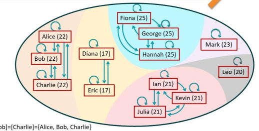

# Relations
is any set of ordered-pair numbers
- deals with connections and interactions between elements

## Cartesian Product
Cartesian product of 2 sets $A\times B$, is the set of ordered pairs (a,b) where a is an element of A and b is an element of B

$$
A \times B = \{ (a,b)|a \in A \wedge b \in B \}
$$

Example:  
$A=\{ a,b \}~~~~ B=\{ 1,2 \}$  
$A\times B=\{ (a,1),(a,2),(b,1),(b,2) \}$  
- each ordered pair in the Cartesian Product consists of an element from set A paired with an element from set B. 

## Functions and the Cross Product
Function:

$$
f: A \to B
$$

implies

$$
f \subseteq A\times B
$$

Example:  
A is the set of students  
B is the set of grades  
$f: A \to B$  
f = {(Alice, A), (Bob, B), (Calvin, B), (Donna, A)}  
$A\times B$ =  
{(Alice, A), (Alice, B), (Alice, C), (Alice, D), (Alice, F),  
(Bob, A), (Bob, B), (Bob, C), (Bob, D), (Bob, F),  
(Calvin, A), (Calvin, B), (Calvin, C), (Calvin, D), (Calvin, F), (Donna, A), (Donna, B), (Donna, C), (Donna, D), (Donna, F)}

# Binary Relations **between 2 sets**
between 2 sets defined as a subset of the cross product between those 2 sets.
- may involve more than 2 sets or less

A relation is a subset of the cross product
- A function is also the same, the function is a specific case of a relation

Example:

$$
\begin{gathered}
A=\{ 0,1,2 \}\\
B=\{ a,b \}\\
A\times B=\{ (0,a),(0,b),(1,a),(1,b),(2,a),(2,b) \}\\
R_{1}=\{ (0,a),(1,a),(2,a) \} \text{ - This is a relation}\\
R_{2}=\{ (0,b),(2,a) \}\\
R_{3}=\{ (1,b) \}
\end{gathered}
$$

$R_{1},R_{2},R_{3}$ are all relations from Set A to Set B

## Binary Relations **On a Set**
A binary relation R **on a set A** is a subset of $A\times A$ or a relation from A to A.

Example:

$$
\begin{gathered}
A = \{ a,b,c \} \\
\text{Relation: }R = \{ (a,a)(a,b)(a,c) \} \text{ is a relation on A.}
\end{gathered}
$$

Example:  
Let A = {1,2,3,4} and R = {(a,b) | a divides b}  
What are the ordered pairs in R?  
- $\text{a divides b} = b\div a \text{ is an integer}$
- (1,1), (1,2) and (2,4)

# Differences between relations and functions
| Relations                                                          | Functions                                                            |
| ------------------------------------------------------------------ | -------------------------------------------------------------------- |
| Domain element can have multiple mappings to elements in subdomain | Domain element can only have 1 output (mapping to subdomain element) |
## Relation Definition Example

| Set A |                         | Set B |                   |
| ----- | ----------------------- | ----- | ----------------- |
| 0     | $\to a$ $\searrow b$ | a     | it has 2 mappings |
| 1     | $\nearrow a$            | b     |                   |
| 2     | $\nearrow b$            |       |                   |

# Representations of a relation

- Directed Graph:
- First 2 are examples of directed graph.
- Matrix OR table:
- 3rd example

## Represent using Digraphs
We draw digraphs to represent relations
- Sets could have other elements but we don't know as they are not in the relation

Example:  
Relation $R = \{ (1,3),(1,4),(2,1),(2,2),(2,3),(3,1),(3,3),(4,1),(4,3) \}$  
From the set {1,2,3,4} to the set {1,2,3,4}  

- First example: 2 sets example
- Second example: 1 set example

# An example of relations + notation
Remember, relation is the **set of ordered pairs**
- (a,b) $\in R$ can be rewritten as 

$$
aRb
$$

Example:  
$R_{1} = \text{"is the son or daughter of"}$ is a relation from a set of kids to a set of parents
- (Alice, Ben) $\in R_{1}$ 
	- Alice is the son or daughter of Ben
$R_{2}=$ "is the parent of" is a relation from a set of parents to a set of kids
- (Alice, Ben) $\in R_{2}$ 
	- Alice is the Parent of Ben

---
# Properties of Relations
## Reflexive Relations
Reflexive Relations means
- (x , x) $\in R$ for every element $x \in A$
- A set of $\{a,b\}$, a reflexive relation of that set will include
	- $(a,a),(b,b)$
		- It CAN INCLUDE OTHER ELEMENTS TOO
		- $(a,a),(b,b),(a,b),(b,a)$

Example:  
A = $\{ \text{Alice,Bob, Carol, David} \}$  
R = "is familiar with" (a,b)  
The relation R will include
- $(Alice,Alice),(Bob,Bob),(Carol,Carol),(David,David)$
- "because every person is familiar with themselves"

Example:  
Set of integers  
Which of these relations are reflexive?

$$
\begin{gathered}
R_{1}=\{ (a,b)|a \le b \}\\
R_{2}=\{ (a,b)|a \gt b \}\\
R_{3}=\{ (a,b)|a = b ~or~ a=-b \}\\
R_{4}=\{ (a,b)|a = b \}\\
R_{5}=\{ (a,b)|a = b+1 \}\\
R_{6}=\{ (a,b)|a + b \le 3\}
\end{gathered}
$$

Reflexive relations are $R_{1},R_{3},R_{4}$
- It cannot be $R_{6}$ because "2" will fit in $R_{6}$ but will not make it reflexive
- Reflexive relation: ALL elements must fit the criteria to themselves

## Symmetric Relations
Symmetric Relations means
- $(x,y)\in R$ whenever $(y,x) \in R$ for all x,y $\in A$
- Formal notation: 
	- $\forall x\forall y((x,y)\in R\implies(y,x)\in R)$

In a symmetric relation, it is okay to swap the order of the elements in the ordered pair. The new pair is also in the relation.

Example:
- R = "is the brother/sister of" is a relation on the set of people
	- This relation is symmetric
- R = "is the older brother/sister of" is a relation on the set of people
	- This relation is <u>not</u> symmetric

Example:  
Set of integers  
Which of these relations are symmetric?

$$
\begin{gathered}
R_{1}=\{ (a,b)|a \le b \}\\
R_{2}=\{ (a,b)|a \gt b \}\\
R_{3}=\{ (a,b)|a = b ~or~ a=-b \}\\
R_{4}=\{ (a,b)|a = b \}\\
R_{5}=\{ (a,b)|a = b+1 \}\\
R_{6}=\{ (a,b)|a + b \le 3\}
\end{gathered}
$$

Symmetric relations are $R_{3},R_{4},R_{6}$

## Antisymmetric Relations
A relation is antisymmetric if
- for all $x,y \in A$
- $(x,y)\in R$ and $(y,x)\in R$, then x = y
- Formal notation:
	- $\forall x\forall y((x,y)\in R\wedge(y,x)\in R\implies x=y)$

Antisymmetric is not the same as NOT symmetric
- It is similar to NOT symmetric + reflexive combined

| Property                | Symmetric relation                                                                                                                           | Antisymmetric relation                                                                                                    |
| ----------------------- | -------------------------------------------------------------------------------------------------------------------------------------------- | ------------------------------------------------------------------------------------------------------------------------- |
| Definition              | For all a,b: if (a,b) ∈ R then (b,a) ∈ R.                                                                                                    | For all a,b: if (a,b) ∈ R and (b,a) ∈ R then a = b.                                                                       |
| Intuition               | Whenever a is related to b, b is also related to a (mutual).                                                                                 | The only time two distinct elements relate both ways is never allowed; mutual relation implies they are the same element. |
| Permitted mutual pairs  | All mutual pairs allowed (including with a ≠ b).                                                                                             | Mutual pairs allowed only when a = b (i.e., only loops).                                     |
| Example on set {1,2}    | R = {(1,2),(2,1)} is symmetric (not antisymmetric).                                                                                          | R = {(1,1),(2,2),(1,2)} is antisymmetric if (2,1) not in R.                                                               |
| Can a relation be both? | Yes — if R is symmetric and whenever (a,b) and (b,a) occur they force a=b. Equivalently R contains only diagonal pairs (subset of identity). | Same as left column: the only relations both symmetric and antisymmetric are subsets of the identity relation             |

Example:  
Let a relation 'is older than' on a set of ages  
older = {(x,y) | x is older than y}  
- $(x,y)\in\text{older}\implies(y,x)\not\in\text{older}$

Example:  
Set of integers  
Which of these relations are antisymmetric?  

$$
\begin{gathered}
R_{1}=\{ (a,b)|a \le b \}\\
R_{2}=\{ (a,b)|a \gt b \}\\
R_{3}=\{ (a,b)|a = b ~or~ a=-b \}\\
R_{4}=\{ (a,b)|a = b \}\\
R_{5}=\{ (a,b)|a = b+1 \}\\
R_{6}=\{ (a,b)|a + b \le 3\}
\end{gathered}
$$

Relations $R_{1},R_{2},R_{4},R_{5}$
- $R_{4}$ because a= b

## Transitive Relations
A relation is transitive if
- whenever (x,y) $\in R$ and (y,z) $\in R$, then (x,z) $\in R$ for all x,y,z $\in A$
- Formal notation:
	- $\forall x\forall y\forall z((x,y)\in R\wedge(y,z)\in R\implies(x,z)\in R)$

Example:  
Let a relation 'is taller than' on a set of people  
(Alice, Bob) $\in R$: Alice is taller than Bob  
(Bob, Carol) $\in R$: Bob is taller than Carol  
We conclude:
- Alice is taller than Carol
	- (Alice, Carol) $\in R$ 

Example:  
Set of integers  
Which of these relations are transitive?

$$
\begin{gathered}
R_{1}=\{ (a,b)|a \le b \}\\
R_{2}=\{ (a,b)|a \gt b \}\\
R_{3}=\{ (a,b)|a = b ~or~ a=-b \}\\
R_{4}=\{ (a,b)|a = b \}\\
R_{5}=\{ (a,b)|a = b+1 \}\\
R_{6}=\{ (a,b)|a + b \le 3\}
\end{gathered}
$$

Relations $R_{1},R_{2},R_{3},R_{4}$ are transitive  
$R_{1}$: $(a,b)=a \le b$, $(b,c)=b \le c$, $(a,c)=a \le c$  is true  
$R_{5}$:
- a = b + 1
- b = c + 1
- a = c + 1 ?
	- Nope statement is not true so that relation is not transitive

## Properties in digraphs
### Reflexive Relation Digraph

- Left: elements a and c does not have self loops

### Symmetric Relation Digraph

- The dual directional arrow signifies symmetric property
	- If there is a one-direction arrow, it is not symmetric

### Antisymmetric Relation Digraph

- Arrows only exist in 1 direction between elements
	- If there is a dual directional arrow, it is not antisymmetric

### Transitive Relation Digraph

- "Shortcut Arrows"
- 2nd graph: Transitivity means: whenever (x,y)∈R and (y,z)∈R, then (x,z)∈R. Take x = d, y = b, z = b. Since (d,b) and (b,b) are in R, transitivity requires (d,b) ∈ R — which is already true.
- First graph: (2,1) and (1,4) is in the graph but there is no shortcut from 2 to 4. The relation is not transitive.

### No property Digraphs

1. Reflexive ❌ because not all elements have a self loop
2. Symmetric ❌ because there are 1 directional arrows
3. Antisymmetric ❌ because there are 2 directional arrows
4. Transitive ❌ because not all elements that are 1 directionally linked with, have the "shortcut arrow" 

---
# Equivalence Relation
is a relation that has all 3 properties:
1. Reflexive
2. Symmetric
3. Transitive

Definition:  
An equivalence relation *R* on an non-empty set S is a subset of the Cartesian product $S\times S$ that satisfies 3 properties: reflexivity, symmetry and transitivity.

Example: "same age"  
Consider a set of people  
2 people are related if they have the same age. $R=\{ (a,b)|\text{a is the same age as b} \}$
- Reflexive property: (Alice, Alice) $\in R$ 
- Symmetric property: $(Alice, Bob) \in R \implies (Bob,Alice) \in R$
- Transitive property: $(Alice,Bob)\in R \wedge (Bob,Charlie) \in R \implies(Alice,Charlie) \in R$
Hence, R is an equivalence relation.

## Equivalence Classes
  
Like the previous example on the set of people where the relation demonstrates people of the same age.
- The digraph shows all 3 properties

- The relation partitioned the set into subsets that are mutually exclusive.
	- These subsets cover the entire set.
	- Each subset is called **equivalence class**
	- "The equivalence class of Alice that includes Alice, Bob and Charlie"
	- "Leo is in an equivalence class of its own"

## Equivalence Relation Examples
Example:  
- Let x be equivalent to y $\iff$ x = y  
	- for any 2 real numbers x and y
- Reflexive property:
	- For any real number x, we know x=x.
- Symmetric property:
	- For any real numbers x and y, 
		- If x = y, then y = x.
			- If 2=2, then 2=2.
- Transitive property:
	- For any real number x, y and z,
		- If x=y and y=z, then x=z
- Since 3 properties satisfy "x is equivalent to y if and only if x equals y" for real numbers
- We can conclude that it is an equivalence relation
	- The equivalence classes would be the number themselves

Example of **NOT a EQUIVALENCE RELATION**:
- On the set R, let $(x,y)\in R$, if and only if x < y, for any x,y $\in R$
- Check reflexive property:
	- For any real number x, x< x, 2 < 2 ?
- Check symmetric property:
	- For any real number x and y,
		- $x < y \implies y< x$ ?
- Check transitive property:
	- For any real number x and y and z,
		- $x<y\wedge y<z \implies x<z$ TRUE
- This relation lacks reflexivity and symmetry, there it cannot be considered an equivalence relation.

Example:  
Let R be a relation on the set of integers where x R y if and only if x = y2.
- Is this an equivalence relation?
	- No because reflexive means x=x2

Example:  
Consider a relation S on the set of all students at SIT, where xSy if and only if "x and y are taking the same academic unit". Which properties does this relation have?
- [x] Reflexivity
- [x] Symmetry
- [ ] Transitivity
- for example x and y share unit A, and y and z share unit B, it does not mean that x and z share the same unit

Example:  
Let T be a relation on the set of positive integers where x T y if and only if x and y have the same prime factors. Is this an equivalence Relation?
- Yes
- x have the same prime factors as itself
- x T y is same as y T x
- x T y, y T z, x has the same prime factors as y which also has the same prime factors as z