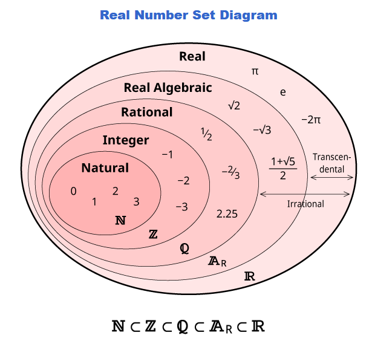
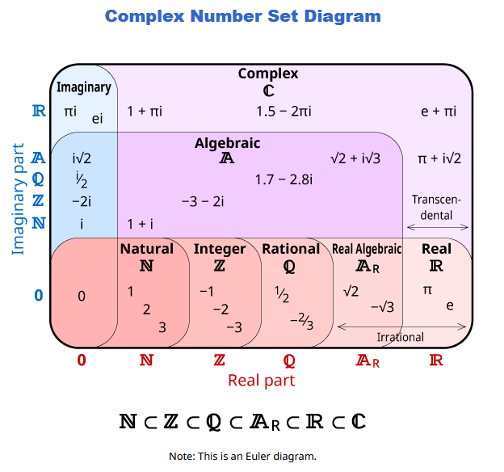
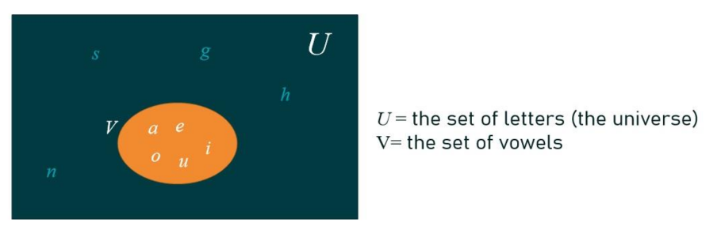
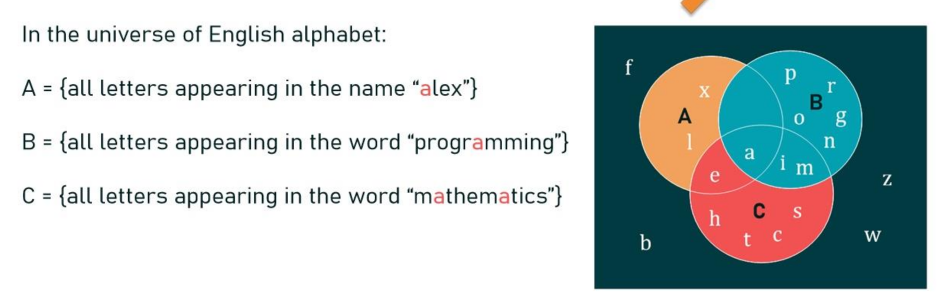
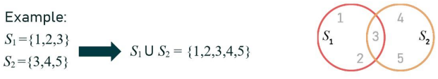
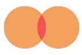
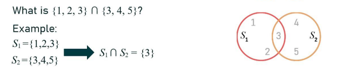
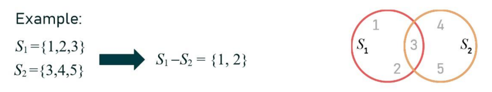
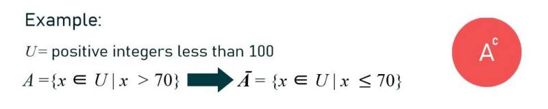

A set is an unordered collection of objects

Objects in the set are called elements or members.  
A set contains specific elements.
- "7 is an element in the set of natural numbers"
- "7 is a member of the set"

- Order is not important. {a,e,i,o,u}={e,u,i,a,o}
- If 2 elements are identical, they are 1 element
	- Listing an element **more than once** does not change the set. {a,e,i,o,u} = {a,e,a,i,o,e,u}
- Ellipses (...) may be used to describe a set when the pattern is clear. $S=\{ a,b,c,d,\dots,z\}$

Describing set examples:
- Need to have a precise definition
	- ✅People in the room
	- ❓People in the room over the age of 21 (may not be known without confirming their age)
	- ❌People in the room that are good in mathematics (Lacks a clear definition)

Set Specification:
- Explain what it includes and what it doesn't
- Clear and unambiguous
- Elements are unique

# Common Sets

- $\mathbb{N}$ : set of all natural numbers
- $\mathbb{Z}$ : set of all integers
- $\mathbb{Q}$ : set of all Rational numbers
- $\mathbb{A}_{R}$ : set of all real algebraic
- $\mathbb{R}$ : set of all real numbers

# Methods describing Sets
## Roster Method
listing all elements.

Example:  
Set of all vowels in the English alphabet. $V=\{a,e,i,o,u\}$

## Predicate Notation
stating properties of the elements. (Use rules/conditions to indicate whether an element belongs to the set or not)

$\{x|P(x)\}$ , where $P(x)$ is a property of x (a predicate/a condition of x)

Examples:  
Under eight set: = $\{x|\text{x is a natural number and x < 8}\}=\{x \in N | x < 8\}$

$S = \{x|x \text{ is a positive integer less than 100}\}$ 
- Roster method: S = {1,2,3,4,5,...,99}
$O = \{x | \text{ x is an odd positive integer less than 10}\} = \{x \in \mathbb{Z}^+ | \text{ x is odd and x < 10}\}$
- Roster method: O = {1,3,5,7,9}
$P = \{\text{x|Prime(x)}\}$

$\mathbb{Q} ^+ = \{x \in \mathbb{R} |x=\frac{p}{q},\text{ for some positive integers p,q}\}$

## Recursive Rules
building the set based on known elements. 

Example:

$$
\begin{gathered}
1.~~~\text{4}\in E \\
2.~~~\text{if x }\in E,\text{ then (x+2) }\in E \\
3. ~~~\text{Nothing else is an element of }E
\end{gathered}
$$

- Predicate Method: E = the set of even numbers greater than 3
- Roster Method: E = {4,6,8,...}

# Universal Set
Universal set U is the set containing **everything currently under consideration**
- similar to domain of a variable

Example of a scenario:
Sets A and B are given as A = {1,2,3} and B = {2,4,6}
- A possible universal set for A and B is U = {1,2,3,4,6}
- It could also be the set for all natural numbers $\mathbb{N}$ or all positive numbers
- ❌It cannot be the set of all cats

# Empty Set
Empty set is the set with no elements

$$
\emptyset = \left\{  \right\} 
$$

# Venn Diagrams
  
- Universal set = rectangle

Example:  

- letter 'a' appears in all 3 sets

# Sets in sets
Anything can be an element in a set  
Sets can be elements of sets

Example:

$$
S_{1} = \left\{ \left\{ 1,2,3 \right\} ,a,\left\{ b,c \right\}  \right\} 
$$

- {1,2,3} is an element of S1, $\left\{ 1,2,3 \right\} \in S_{1}$ 
- $a \in S_{1}$
- 3 is not an element of S1, $b \not\in S_{1}$
- $b \not\in S_{1}$

Example:

$$
\emptyset \neq \left\{ \emptyset \right\} 
$$

- Empty Set is not the same as a set that contains an empty set

# Set Equality
2 sets are equal if and only if they have the same elements:

$$
A = B \equiv \forall x(x \in A \leftrightarrow x \in B)
$$

---
# Set Operations
## Union
The union of the sets A and B, denoted by $A \cup B$
- It contains all elements that are in Set A and all elements that are in Set B

Example:  

## Intersection
The intersection of sets A and B, denoted by $A\cap B$
- It contains all elements that are in both Sets A and B.

  
The shaded red part is the intersection set/part

Example:  
If A and B have no matching elements:  

- If the intersection is empty, then A and B are said to be disjoint.

Example:  

## Difference
Difference between set A and set B, denoted by $A-B$ OR $A \setminus B$ 
- It is the set containing the elements of A that are not in B
$A-B=\left\{ x|x \in A \wedge x \in B \right\} = A \cap \overline{B}$

Example:  

## Complement
The complement of set A (with respect to U). Denoted by $A' or \overline{A}$
- is the set or all elements that are not in A
$A' = \left\{ x \in U |x \not\in A \right\}$

Example:  

---
# Subsets
The set A is a subset of B, if and only if every element of A is also an element of B.
- In a Venn diagram, A is a set that is included within the set B

If A = B,
- $A \subseteq B$
- $B \subseteq A$

Example:
- A is the set of natural even numbers, A = {2,4,6,8,..}
- B is the set of all natural numbers, B = {1,2,3,4,5,...}
- $A\subseteq B$

Example:
- $\left\{ a,b \right\}\subseteq \left\{ a,b,c,d \right\}$
- $\left\{ a,b \right\}\subseteq \left\{ a,b \right\}$
- $\left\{ a,b \right\}\subseteq \left\{ a,c,d \right\}$
- $\left\{ \text{kids in the family} \right\}\subseteq \left\{ \text{family members} \right\}$

## Nature of subsets

$$
A\subseteq B \iff \forall x(x \in A\implies x \in B)
$$

If x is an element in a, then it is also an element in B.

Every set is guaranteed to have at least 2 subsets:

### All set is a subset of itself

$$
\forall S(S\subseteq S)
$$

Every element in the set S is also an element in the set S

### Empty set is a subset of all sets

$$
\forall S(\emptyset \subseteq S)
$$

Every element in $\emptyset$ is also an element in S.

## Showing subsets
Show that A is a subset of B  
Definition: $A\subseteq B\leftrightarrow \forall x(x \in A \implies x \in B)$
- Show that every element in A is also an element in B

Show that A is not a subset of B  
Definition: $\neg (A\subseteq B)\leftrightarrow \exists x (x \in A \wedge x \not\subseteq B)$
- Show there exist an element that is in A but not in B

## Proper subsets
If $A\subseteq B$, but A $\neq$ B, then A is a proper subset of B. Denoted by $A \subset B$.

Definition: 

$$
A \subset B \leftrightarrow \forall x(x \in A \implies x \in B)\wedge \exists x(x \in B \wedge x \not\in A)
$$

- A is a subset of B
- x belongs to B, but it does not belong to A

---
# Set Identities
are statements that express the equality of 2 sets, meaning that they have the same elements.

## Identity Law
The union between any set and the empty set returns the set itself.  
The intersection between any set and the entire universe, returns the set itself.

$$
\begin{gathered}
A \cup \emptyset = A \\
A \cap U = A
\end{gathered}
$$

## Domination Laws
$$
\begin{gathered}
A \cup U = U \\
A \cap \emptyset = \emptyset
\end{gathered}
$$

## Idempotent Laws
$$
\begin{gathered}
A \cup A = A \\
A \cap A = A
\end{gathered}
$$

## Complementation Law / Double Complement Law
$$
\overline{\overline{(A)}} = A
$$

## Commutative Laws
$$
\begin{gathered}
A \cup B = B \cup A \\
A \cap B = B \cap A
\end{gathered}
$$

## Associative Laws
$$
\begin{gathered}
A \cup (B \cup C) = (A \cup B) \cup C \\
A \cap (B \cap C) = (A \cap B) \cap C
\end{gathered}
$$

## Distributive Laws
like exponential and propositional laws

$$
\begin{gathered}
A \cap (B \cup C) = (A\cap B) \cup (A \cap C) \\
A \cup(B\cap C)=(A\cup B)\cap(A\cup C)
\end{gathered}
$$

## De Morgan's Laws
$$
\begin{gathered}
\overline{A\cup B} = \overline{A}\cap \overline{B} \\
\overline{A\cap B} = \overline{A} \cup \overline{B}
\end{gathered}
$$

## Absorption Laws
$$
\begin{gathered}
A\cup(A\cap B)=A \\
A\cap(A\cup B)=A
\end{gathered}
$$

## Complement Laws
$$
\begin{gathered}
A\cup \overline{A}=U \\
A\cap \overline{A}=\emptyset
\end{gathered}
$$

# Proving Set Identities
## Method 1 (Set equality)
First way is to look at the definition of set equality.

$$
A=B\leftrightarrow (A\subseteq B)\wedge(B\subseteq A)
$$

A equals to B if and only if A is a subset of B and B is a subset of A
- If we show both of these, then the sets must be equal

Example:  
Prove that $\overline{A\cap B}= \overline{A}\cup \overline{B}$ (Proof of Second De Morgan Law)
- Show:
- $\overline{A\cap B}\subseteq \overline{A}\cup \overline{B}$
- $\overline{A}\cup \overline{B}\subseteq \overline{A\cap B}$

| Step 1                                      | Reason                                        |
| ------------------------------------------- | --------------------------------------------- |
| $x \in \overline{A\cap B}$                  | by assumption                                 |
| $x \not\in A \cap B$                        | definition of complement                      |
| $\neg((x \in A)\wedge(x \in B))$            | definition of intersect                       |
| $\neg(x \in A)\vee \neg(x \in B)$           | by 1st De Morgan Law from propositional logic |
| $x \not\in A \vee x \not\in B$              | definition of negation                        |
| $x \in \overline{A}\vee x \in \overline{B}$ | definition of complement                      |
| $x \in \overline{A} \cup \overline{B}$      | definition of union                           |
|                                             |                                               |
| **Step 2**                                  | **Reason**                                    |
| $x \in \overline{A} \cup \overline{B}$      | Assumption                                    |
| $x \in \overline{A}\vee x \in \overline{B}$ | Definition of union                           |
| $x \not\in A \vee x \not\in B$              | Definition of complement                      |
| $\neg(x \in A)\vee \neg(x \in B)$           | Definition of negation                        |
| $\neg((x \in A)\wedge(x \in B))$            | by 1st De Morgan Law from propositional logic |
| $\neg(x\in A \cap B)$                       | Definition of intersect                       |
| $x \in \overline{A\cap B}$                  | Definition of complement                      |

## Method 2 (Predicate)
Use predicates to specify both sets and show they are both equal  
Get predicates:
- A = {x | P(x)}
- B = {x | Q(x)}
Show $P(x) \equiv Q(x)$, to prove A=B

Example: Prove that $\overline{A\cap B}= \overline{A}\cup \overline{B}$ (Proof of Second De Morgan Law)

| Step                                                 | Reason                                    |
| ---------------------------------------------------- | ----------------------------------------- |
| $\overline{A\cap B}$                                 |                                           |
| { x \| x $\not\in \overline{A}\cap \overline{B}$ }   | Definition of complement, as a predicate  |
| { x \| $\neg(x \in (A\cap B))$ }                     | Definition of does not belong symbol      |
| { x \| $\neg(x \in A \wedge x \in B)$ }              | Definition of intersection                |
| { x \| $\neg(x \in A)\vee \neg(x \in B)$ }           | By De Morgan Law from Propositional Logic |
| { x \| $x \not\in A\vee x \not\in B$ }               | Definition of not belong symbol           |
| { x \| $x \in \overline{A}\vee x \in \overline{B}$ } | Definition of complement                  |
| { x \| $x \in \overline{A}\cup \overline{B}$ }       | Definition of Union                       |
| $\overline{A}\cup \overline{B}$                      | Meaning of notation                       |

## Method 3 (Membership Table)
Membership table equivalent to showing truth table equivalency  
'1' is the element in the set, '0' is the element not in the set

### Example 1:
| A   | B   | $A\cup B$ | $\overline{A\cup B}$ | $\overline{A}$ | $\overline{B}$ | $\overline{A}\cap \overline{B}$ |
| --- | --- | --------- | -------------------- | -------------- | -------------- | ------------------------------- |
| 1   | 1   | 1         | 0                    | 0              | 0              | 0                               |
| 1   | 0   | 1         | 0                    | 0              | 1              | 0                               |
| 0   | 1   | 1         | 0                    | 1              | 0              | 0                               |
| 0   | 0   | 0         | 1                    | 1              | 1              | 1                               |
|     |     |           | ^ same               |                |                | ^ same                          |

### Example 2 (Distributive Law proof):
| #   | A   | B   | C   | $B\cap C$ | $A\cup(B\cap C)$ | $A\cup B$ | $A\cup C$ | $(A\cup B)\cap(A\cup C)$ |
| --- | --- | --- | --- | --------- | ---------------- | --------- | --------- | ------------------------ |
| 1   | 1   | 1   | 1   | 1         | 1                | 1         | 1         | 1                        |
| 2   | 1   | 1   | 0   | 0         | 1                | 1         | 1         | 1                        |
| 3   | 1   | 0   | 1   | 0         | 1                | 1         | 1         | 1                        |
| 4   | 1   | 0   | 0   | 0         | 1                | 1         | 1         | 1                        |
| 5   | 0   | 1   | 1   | 1         | 1                | 1         | 1         | 1                        |
| 6   | 0   | 1   | 0   | 0         | 0                | 1         | 0         | 0                        |
| 7   | 0   | 0   | 1   | 0         | 0                | 0         | 1         | 0                        |
| 8   | 0   | 0   | 0   | 0         | 0                | 0         | 0         | 0                        |
|     |     |     |     |           | ^                |           |           | ^                        |
- Proof of $A\cup(B\cap C)=(A\cup B)\cap(A\cup C)$

# Cardinality
The cardinality of a finite set A is the number of (distinct) elements of A.  
Denoted by $|A|$
- Size of the set
- Number of elements within a set

Example:
- $|\emptyset|=0$
- Let S be the letters of the English alphabet. $|S|=26$
- $|\left\{ \emptyset \right\}| = 1$
- $|{1,2,3}|=3$
- $|\left\{ \left\{ a,b \right\} c,d\right\}| = 3$
- $|\mathbb{Z}|$ is infinite

# Power Set
The power set of A is the set of **all subsets of a set A**.  
Denoted by P(A)
1. Empty Set
2. Itself
3. Sets of all elements  (Apply the set to each element) (Can always check with cardinality = 2n)

Example:  
Set A = {x,y}  
P(A) = {$\emptyset,\left\{ x \right\},\left\{ y \right\},\left\{ x,y \right\}$}

Example:  
$\mathscr{P}( \left\{ a,b,\left\{ a,b \right\} \right\}) = \left\{ \emptyset,\left\{ a,b,\left\{ a,b \right\} \right\},\left\{ a \right\},\left\{ b \right\},\left\{ \left\{ a,b \right\} \right\}, \left\{ a,b \right\},\left\{ a,\left\{ a,b \right\} \right\},\left\{ b,\left\{ a,b \right\} \right\} \right\}$  
Look at last 2 elements

Example:  
$\mathscr{P}( \mathscr{P}(\emptyset)) = \left\{ \emptyset,\mathscr{P}(\emptyset) \right\} = \left\{ \emptyset,\left\{ \emptyset \right\} \right\}$  
Because $\mathscr{P}(\emptyset)$ is a set of an empty set

## 2n elements property for Power Sets
For a set with *n* elements
- the number of elements in the power set is 2n
	- because each element of the set ,can either be a member or not a member of a subset

# Ordered Pair
Consist of 2 elements where the order of the elements matters.

# Tuple
- A tuple is an ordered collection of objects.
	- tuple of 2 elements = ordered pair
- Notated by: A = (b,c)

2 tuples are equal if and only if their corresponding elements are equal.

# Cartesian Products
Cartesian product of 2 sets A and B is the set of ordered pairs (a,b) where $a \in A$ and $b \in B$  
A x B = { (a,b) | $a \in A \wedge b \in B$ }
- Something like algebraic multiplication

Example:
- A = {a,b}
- B = {1,2,3}
- $A \times B=\left\{ (a,1),(a,2),(a,3),(b,1),(b,2),(b,3) \right\}$
- $|A\times B| = |A|\times |B|=2\times3=6$
